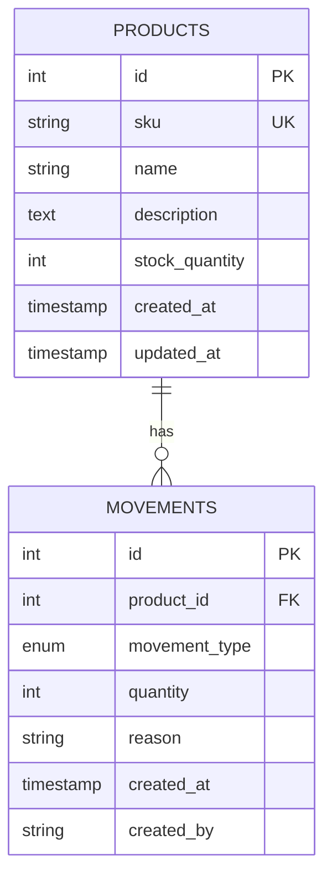

# 📋 PRD: WMS Lite - Sistema de Gestión de Inventarios

## 📌 Información del Documento

| Campo | Valor |
|---|---|
| **Producto** | WMS Lite (Warehouse Management System - Lite) |
| **Versión** | 1.0 |
| **Fecha** | Enero 2026 |
| **Estado** | En Desarrollo |
| **Autor** | Angel Jesus Zorrilla Cuevas |

---

## 🎯 1. Visión General

### 1.1 Descripción
WMS Lite es un sistema backend de gestión de inventarios diseñado para pequeñas y medianas empresas que necesitan rastrear productos y movimientos de stock con integridad transaccional.

### 1.2 Problema que Resuelve
**Problemas actuales:**
- ✗ Control manual de inventarios (Excel, papel)
- ✗ Inconsistencias en el stock (race conditions)
- ✗ Falta de trazabilidad (¿quién movió qué y cuándo?)
- ✗ Stock negativo por errores humanos
- ✗ Sin auditoría de operaciones

**Solución:**
- ✓ API RESTful para integración con múltiples frontends
- ✓ Transacciones ACID (integridad garantizada)
- ✓ Historial completo de movimientos
- ✓ Validaciones automáticas (stock >= 0)
- ✓ Trazabilidad completa (created_by, timestamps)

### 1.3 Usuarios Objetivo

| Rol | Uso |
|---|---|
| **Almacenista** | Registra entradas/salidas de mercancía |
| **Gerente de Operaciones** | Consulta stock, genera reportes |
| **Sistema Externo** | Integración vía API (e-commerce, ERP) |
| **Auditor** | Revisa historial de movimientos |

---

## 🎯 2. Objetivos del Producto

### 2.1 Objetivos de Negocio
- Reducir errores de inventario en 90% mediante validaciones automáticas
- Proporcionar trazabilidad completa de todas las operaciones
- Evitar pérdidas por stock negativo con constraints de DB
- Soportar 100+ operaciones/minuto con arquitectura escalable

### 2.2 Objetivos Técnicos
- API RESTful siguiendo estándares de la industria
- Tiempo de respuesta < 200ms en el 95% de requests
- 99.9% uptime mediante graceful shutdown y health checks
- Código mantenible con arquitectura en capas
- Testing automatizado (unit, integration, e2e)

---

## 📦 3. Alcance (Scope)

### 3.1 MVP (Versión 1.0) - ✅ EN DESARROLLO
**Incluye:**
- ✅ CRUD completo de Productos
- ✅ Registro de Movimientos de Inventario (IN/OUT)
- ✅ Validaciones transaccionales (evitar race conditions)
- ✅ Historial de movimientos por producto
- ✅ Paginación en listados
- ✅ Health check endpoint
- ✅ Docker + Docker Compose setup
- ✅ PostgreSQL con scripts de inicialización

**NO Incluye (Fase 2+):**
- ❌ Autenticación/Autorización (JWT)
- ❌ Multi-tenancy (múltiples almacenes)
- ❌ Reportes avanzados (gráficas, analytics)
- ❌ Alertas (stock bajo, stock crítico)
- ❌ Integración con proveedores externos

### 3.2 Fuera de Alcance
- Frontend (solo API backend)
- Facturación
- Gestión de usuarios
- Envíos/Logistics

---

## 🏗️ 4. Arquitectura Técnica

### 4.1 Stack Tecnológico

| Componente | Tecnología | Versión | Justificación |
|---|---|---|---|
| **Lenguaje** | Go | 1.22+ | Performance, concurrencia, simplicidad |
| **Framework Web** | Gin | 1.10+ | Rápido, ligero, popular |
| **Base de Datos** | PostgreSQL | 16 | ACID, transacciones robustas |
| **SQL Driver** | sqlx | 1.4+ | SQL explícito, sin ORM |
| **Containerización** | Docker | Latest | Portabilidad, consistencia |
| **Orquestación** | Docker Compose | V2 | Multi-container setup |
| **Config** | godotenv | 1.5+ | Variables de entorno |

### 4.2 Arquitectura de Software
**Package Oriented Design (3 capas):**

```text
┌─────────────────────────────────────────┐
│  HANDLER (HTTP Layer)                   │
│  - Parsear requests                     │
│  - Validar formato HTTP                 │
│  - Códigos de estado                    │
│  - Serializar respuestas                │
└─────────────┬───────────────────────────┘
              │
              ▼
┌─────────────────────────────────────────┐
│  SERVICE (Business Logic)               │
│  - Reglas de negocio                    │
│  - Validaciones complejas               │
│  - Coordinación entre repos             │
│  - Transacciones                        │
└─────────────┬───────────────────────────┘
              │
              ▼
┌─────────────────────────────────────────┐
│  REPOSITORY (Data Access)               │
│  - SQL queries                          │
│  - Mapeo DB ↔ Models                    │
│  - Context timeouts                     │
└─────────────────────────────────────────┘
```

**Principios aplicados:**
- ✅ Separation of Concerns
- ✅ Dependency Injection
- ✅ Single Responsibility
- ✅ Interface Segregation

### 4.3 Estructura de Carpetas
```
wms-lite/
├── cmd/
│   └── api/
│       └── main.go              # Entrypoint, wiring de dependencias
├── internal/
│   ├── platform/
│   │   ├── database.go          # Conexión PostgreSQL + pool
│   │   └── env.go               # Carga de configuración
│   ├── product/
│   │   ├── model.go             # Structs, DTOs
│   │   ├── repository.go        # SQL queries
│   │   ├── service.go           # Business logic
│   │   └── handler.go           # HTTP endpoints
│   └── movement/                # (Próximo paso)
│       ├── model.go
│       ├── repository.go
│       ├── service.go
│       └── handler.go
├── scripts/
│   └── init.sql                 # Inicialización de DB
├── .env                         # Variables de entorno (local)
├── compose.yaml                 # Docker Compose V2
├── Dockerfile                   # Multi-stage build
└── go.mod                       # Dependencias Go
```

---

## 📊 5. Modelo de Datos

### 5.1 Entidades Principales

**Tabla: products**

| Campo | Tipo | Constraints | Descripción |
|---|---|---|---|
| id | SERIAL | PRIMARY KEY | ID autogenerado |
| sku | VARCHAR(50) | UNIQUE, NOT NULL | Código único del producto |
| name | VARCHAR(255) | NOT NULL | Nombre del producto |
| description | TEXT | - | Descripción detallada |
| stock_quantity | INTEGER | NOT NULL, >= 0 | Stock actual |
| created_at | TIMESTAMP | DEFAULT NOW() | Fecha de creación |
| updated_at | TIMESTAMP | DEFAULT NOW() | Última actualización |

**Índices:**
- `idx_products_sku` en sku (búsquedas frecuentes)

**Tabla: movements**

| Campo | Tipo | Constraints | Descripción |
|---|---|---|---|
| id | SERIAL | PRIMARY KEY | ID autogenerado |
| product_id | INTEGER | FK → products(id), NOT NULL | Producto asociado |
| movement_type | ENUM | 'IN', 'OUT', NOT NULL | Tipo de movimiento |
| quantity | INTEGER | NOT NULL, > 0 | Cantidad movida |
| reason | VARCHAR(255) | - | Motivo del movimiento |
| created_at | TIMESTAMP | DEFAULT NOW() | Fecha del movimiento |
| created_by | VARCHAR(100) | - | Usuario que lo registró |

**Índices:**
- `idx_movements_product_id` en product_id (consultas por producto)
- `idx_movements_created_at` en created_at DESC (historial reciente)

**Constraints:**
- `ON DELETE RESTRICT` en FK: No permite borrar productos con movimientos

### 5.2 Diagrama E-R


---

## 🔌 6. API Endpoints

### 6.1 Base URL
```
http://localhost:4002/api/v1
```

### 6.2 Endpoints de Productos

#### POST /products - Crear Producto
**Request:**
```json
{
  "sku": "LAPTOP-001",
  "name": "MacBook Pro M3",
  "description": "Laptop profesional",
  "stock_quantity": 10
}
```
**Response: 201 Created**
```json
{
  "id": 1,
  "sku": "LAPTOP-001",
  "name": "MacBook Pro M3",
  "description": "Laptop profesional",
  "stock_quantity": 10,
  "created_at": "2026-01-29T14:30:00Z",
  "updated_at": "2026-01-29T14:30:00Z"
}
```
**Errores:**
- `400` - Datos inválidos (SKU vacío, stock < 0)
- `409` - SKU ya existe

#### GET /products - Listar Productos
**Query Params:**
- `page` (default: 1)
- `page_size` (default: 10, max: 100)

**Response: 200 OK**
```json
{
  "data": [
    {
      "id": 1,
      "sku": "LAPTOP-001",
      "name": "MacBook Pro M3",
      "stock_quantity": 10,
      ...
    }
  ],
  "pagination": {
    "page": 1,
    "page_size": 10,
    "total": 45,
    "total_pages": 5
  }
}
```

#### GET /products/:id - Obtener Producto
**Response: 200 OK**
```json
{
  "id": 1,
  "sku": "LAPTOP-001",
  ...
}
```
**Errores:**
- `400` - ID inválido
- `404` - Producto no encontrado

#### GET /products/sku/:sku - Obtener por SKU
**Response: 200 OK**
**Errores:**
- `404` - SKU no encontrado

#### PUT /products/:id - Actualizar Producto
**Request:**
```json
{
  "name": "MacBook Pro M3 Max",
  "description": "Nueva descripción"
}
```
**Notas:**
- Solo permite actualizar `name` y `description`
- NO permite actualizar `sku` (inmutable)
- NO permite actualizar `stock_quantity` (solo con movements)

**Response: 200 OK**
**Errores:**
- `400` - Datos inválidos
- `404` - Producto no encontrado

#### DELETE /products/:id - Eliminar Producto
**Response: 204 No Content**
**Errores:**
- `400` - ID inválido
- `404` - Producto no encontrado
- `500` - Producto tiene movimientos (constraint DB)

### 6.3 Endpoints de Movimientos (Fase 1 - Próximo)

#### POST /movements - Registrar Movimiento
**Request:**
```json
{
  "product_id": 1,
  "movement_type": "IN",
  "quantity": 50,
  "reason": "Compra a proveedor XYZ",
  "created_by": "usuario@email.com"
}
```
**Lógica:**
1. Si `movement_type = "IN"`: stock += quantity
2. Si `movement_type = "OUT"`: stock -= quantity
3. **Validación:** Si OUT, verificar stock >= quantity
4. **Transacción:** UPDATE stock + INSERT movement (atómico)
5. **Lock pesimista:** SELECT ... FOR UPDATE

**Response: 201 Created**

#### GET /movements - Historial de Movimientos
**Query Params:**
- `page`, `page_size`
- `product_id` (filtrar por producto)
- `movement_type` (filtrar IN/OUT)

**Response: 200 OK**

#### GET /movements/product/:id - Movimientos de un Producto
**Response: 200 OK**

### 6.4 Health Check
#### GET /health
**Response: 200 OK**
```json
{
  "status": "ok",
  "timestamp": 1706543025
}
```

---

## 🎬 7. Casos de Uso

### 7.1 Flujo: Recepción de Mercancía
**Actor:** Almacenista

**Pasos:**
1. Proveedor entrega 50 laptops
2. Almacenista verifica SKU: `LAPTOP-001`
3. Sistema registra movimiento:
   ```http
   POST /movements
   {
     "product_id": 1,
     "movement_type": "IN",
     "quantity": 50,
     "reason": "Compra a proveedor Dell Inc.",
     "created_by": "almacenista@empresa.com"
   }
   ```
4. Sistema actualiza stock: `10 → 60`
5. Sistema registra en historial

**Validaciones:**
- ✅ Producto existe
- ✅ Quantity > 0
- ✅ Transacción atómica (UPDATE + INSERT)

---

### 7.2 Flujo: Salida por Venta
**Actor:** Sistema de E-commerce

**Pasos:**
1. Cliente compra 3 laptops
2. E-commerce llama API:
   ```http
   POST /movements
   {
     "product_id": 1,
     "movement_type": "OUT",
     "quantity": 3,
     "reason": "Venta - Orden #12345",
     "created_by": "ecommerce-system"
   }
   ```
3. Sistema valida: stock (60) >= quantity (3) ✅
4. Sistema actualiza stock: 60 → 57
5. Sistema registra movimiento

**Validaciones:**
- ✅ Stock suficiente
- ✅ Lock pesimista (previene race condition)
- ✅ Transacción atómica

### 7.3 Flujo: Stock Insuficiente
**Escenario:** Intento de sacar más stock del disponible

**Pasos:**
1. Stock actual: 5 unidades
2. Intento de salida: 10 unidades
3. Sistema valida: 5 >= 10 ❌
4. Sistema retorna `400 Bad Request`:
   ```json
   {
     "error": "Stock insuficiente. Disponible: 5, Solicitado: 10"
   }
   ```
5. Transacción hace ROLLBACK

---

### 7.4 Flujo: Prevención de Race Condition
**Escenario:** Dos usuarios intentan sacar stock simultáneamente

**Stock inicial:** 10 unidades

**Thread 1 y Thread 2 solicitan 7 unidades cada uno:**

```sql
T1: BEGIN TRANSACTION
T1: SELECT stock FROM products WHERE id=1 FOR UPDATE  -- 🔒 LOCK
T1: stock = 10, quantity = 7 → OK (10 >= 7)
T1: UPDATE products SET stock = 3

T2: BEGIN TRANSACTION
T2: SELECT stock FROM products WHERE id=1 FOR UPDATE
    ⏳ ESPERA (row bloqueada por T1)

T1: INSERT INTO movements (...)
T1: COMMIT  -- 🔓 UNLOCK

T2: (ahora puede leer)
T2: stock = 3, quantity = 7 → FAIL (3 < 7)
T2: ROLLBACK
T2: Error: Stock insuficiente
```

**Resultado:**
- ✅ Solo un thread exitoso
- ✅ Stock final: 3 (correcto)
- ✅ Sin stock negativo

---

## 🚀 8. Roadmap

### Fase 1: MVP (4 semanas) - ✅ ACTUAL
- [x] Setup de proyecto (Docker, PostgreSQL)
- [x] Módulo de Productos (CRUD completo)
- [ ] Módulo de Movimientos (IN/OUT transaccional)
- [ ] Tests unitarios (coverage > 80%)
- [ ] Hot reload con Air
- [ ] Documentación API (Swagger/OpenAPI)

### Fase 2: Mejoras (2 semanas)
- [ ] Autenticación JWT
- [ ] Autorización por roles (Admin, User, Readonly)
- [ ] Soft delete de productos
- [ ] Búsqueda y filtros avanzados
- [ ] Exportar reportes (CSV, PDF)

### Fase 3: Escalabilidad (3 semanas)
- [ ] Multi-tenancy (múltiples almacenes)
- [ ] Redis para caché
- [ ] Rate limiting
- [ ] Métricas (Prometheus)
- [ ] Logs estructurados (JSON)
- [ ] CI/CD pipeline

### Fase 4: Analytics (2 semanas)
- [ ] Dashboard de stock
- [ ] Alertas de stock bajo
- [ ] Reportes de rotación de inventario
- [ ] Predicción de demanda (ML básico)

---

## 📈 9. Métricas de Éxito

### 9.1 Métricas Técnicas
| Métrica | Objetivo | Actual |
|---|---|---|
| Tiempo de respuesta (p95) | < 200ms | TBD |
| Uptime | > 99.9% | TBD |
| Test coverage | > 80% | 0% (pendiente) |
| Errores 5xx | < 0.1% | TBD |
| Throughput | > 100 req/s | TBD |

### 9.2 Métricas de Negocio
| Métrica | Objetivo |
|---|---|
| Errores de inventario | Reducción del 90% vs proceso manual |
| Tiempo de registro | < 30 segundos por movimiento |
| Adopción de usuarios | > 80% en 1 mes |
| Satisfacción de usuarios | > 4.5/5 |

---

## 🔒 10. Seguridad (Fase 2)

**Implementaciones Futuras:**
- **Autenticación:** JWT tokens
- **Autorización:** RBAC (Role-Based Access Control)
- **Rate Limiting:** 100 req/min por IP
- **SQL Injection:** ✅ Ya prevenido (queries parametrizados)
- **CORS:** Configuración restrictiva
- **HTTPS:** Certificados SSL/TLS
- **Secrets:** Vault o AWS Secrets Manager

---

## 📚 11. Documentación

### 11.1 Documentación Actual
- ✅ README.md (setup instructions)
- ✅ Comentarios en código (Go doc style)
- ✅ PRD (este documento)

### 11.2 Documentación Pendiente
- [ ] OpenAPI/Swagger spec
- [ ] Postman collection
- [ ] Guía de contribución
- [ ] Architecture Decision Records (ADRs)
- [ ] Runbook operacional

---

## 🎯 12. Criterios de Aceptación MVP
El MVP se considera completo cuando:

- ✅ **Productos:** CRUD funcional
- ⏳ **Movimientos:** Registro transaccional IN/OUT
- ⏳ **Validaciones:** Stock no puede ser negativo
- ⏳ **Concurrencia:** Race conditions prevenidas
- ⏳ **Tests:** Coverage > 80%
- ⏳ **Docker:** Deploy con un comando (`docker compose up`)
- ⏳ **Documentación:** API docs completas
- ⏳ **Performance:** < 200ms en p95

**Estado actual:** 30% completado

---

## 📞 13. Stakeholders

| Rol | Nombre | Responsabilidad |
|---|---|---|
| Product Owner | TBD | Priorización de features |
| Tech Lead | Tu Nombre | Arquitectura, code reviews |
| Backend Dev | Tu Nombre | Implementación |
| QA | TBD | Testing, validación |
| DevOps | TBD | Deploy, infraestructura |

---

## 📝 14. Notas Adicionales

### Decisiones de Diseño
- **¿Por qué Go?** Performance + simplicidad + excelente para APIs
- **¿Por qué sqlx en lugar de GORM?** Aprendizaje de SQL, control fino, menos "magia"
- **¿Por qué PostgreSQL?** Transacciones ACID robustas, ENUM types, JSON support
- **¿Por qué Package Oriented Design?** Escalabilidad, testing, separación por dominio

### Riesgos Identificados

| Riesgo | Impacto | Mitigación |
|---|---|---|
| Race conditions en stock | Alto | SELECT FOR UPDATE + transacciones |
| Performance con muchos movimientos | Medio | Índices en DB, paginación |
| Falta de autenticación | Alto | Implementar en Fase 2 |
| Logs no estructurados | Bajo | JSON logging en Fase 3 |

---

### ✅ Checkpoint
**🔍 ¿Hiciste algún ajuste en el código o estructura?**
Ahora que tienes el PRD completo:
- ¿Hay algo en el alcance que quieras modificar?
- ¿Alguna feature que quieras priorizar diferente?
- ¿Necesitas agregar algún requisito adicional?

**Siguiente paso:** Implementar Hot Reload con Air para mejorar tu flujo de desarrollo.